<h1 align="center" style="font-weight: bold;">Sistema pizzaria 🍕</h1>

<p align="center">
 <a href="#tech">Tecnologias</a> • 
 <a href="#started">Primeiros Passos</a> • 
 
</p>

<p align="center">
    <b>Desenvolvimento de uma plataforma de gestão de pizzaria</b>
</p>

<h2 id="layout">🎨 Layout</h2>

<p align="center">
    
    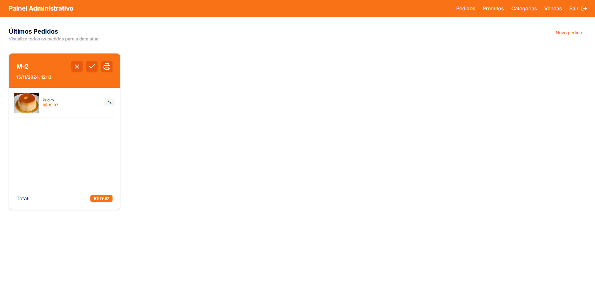
    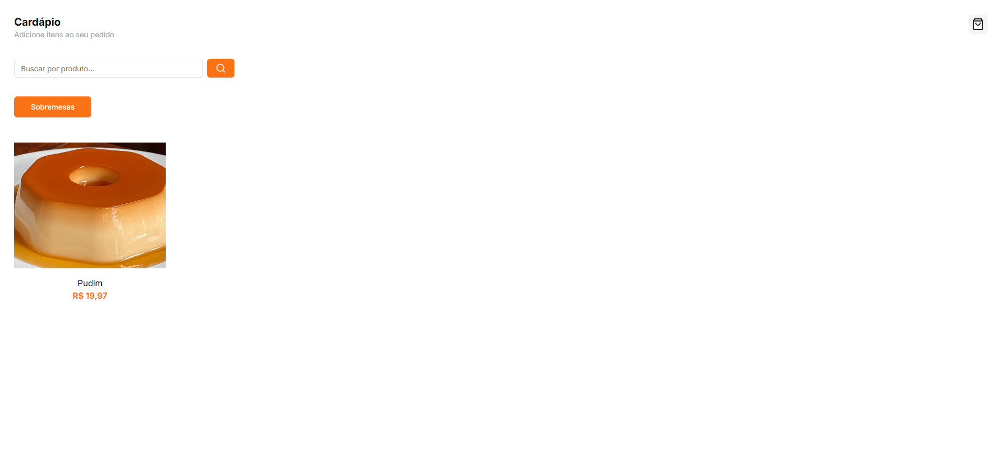
    
    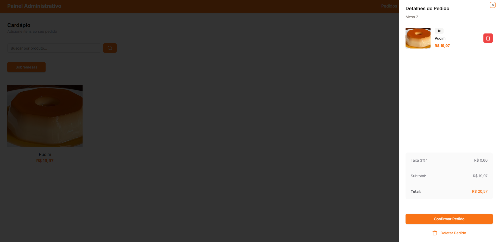
    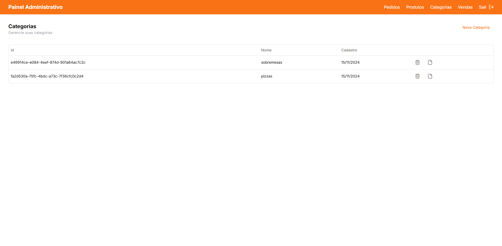
    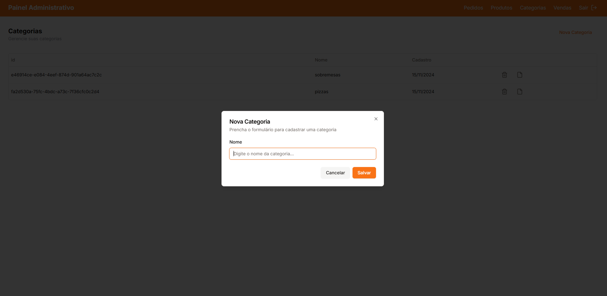
    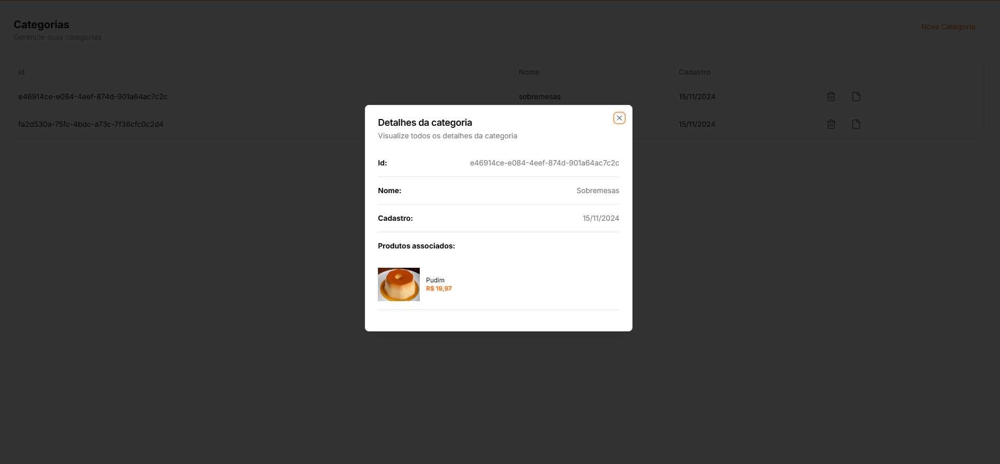
    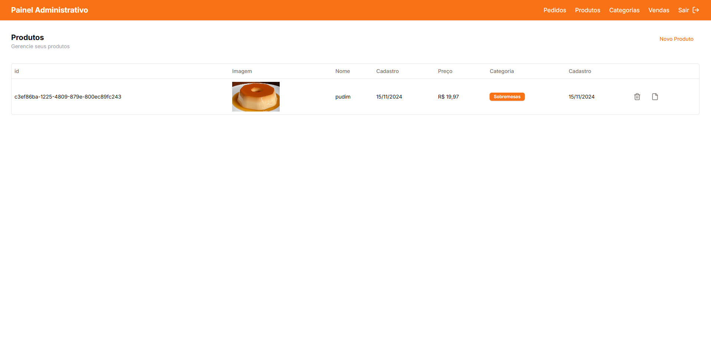
    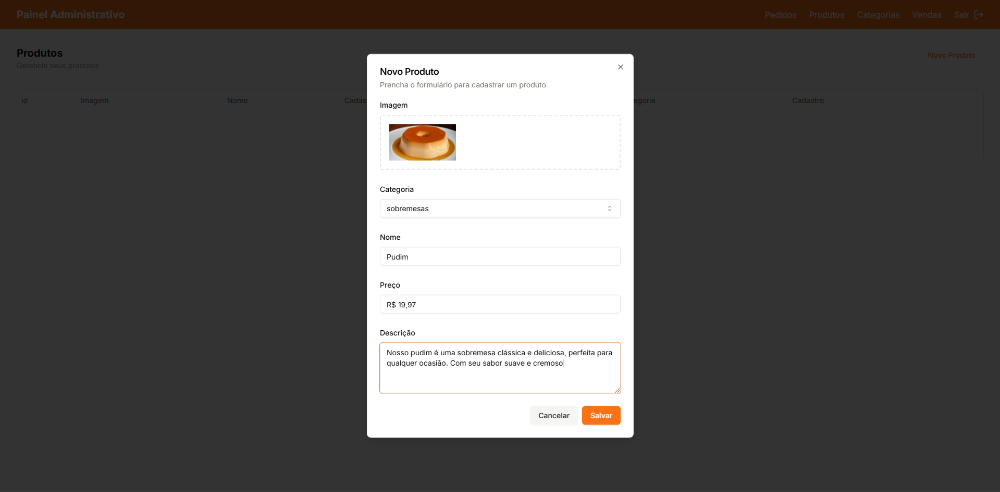
    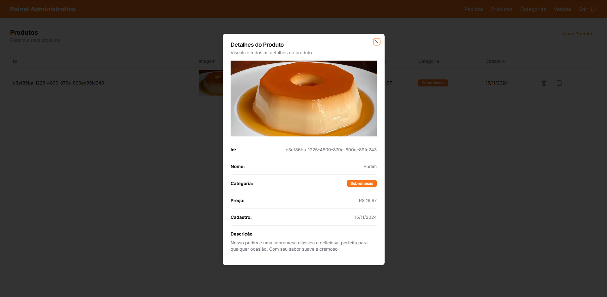
    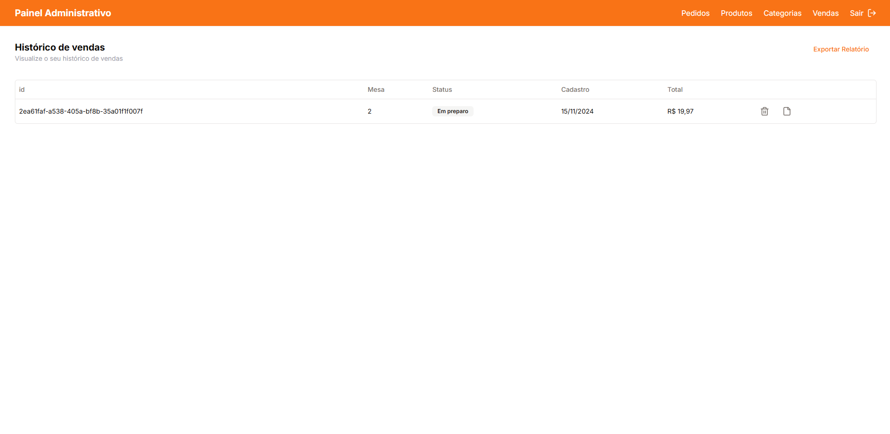
    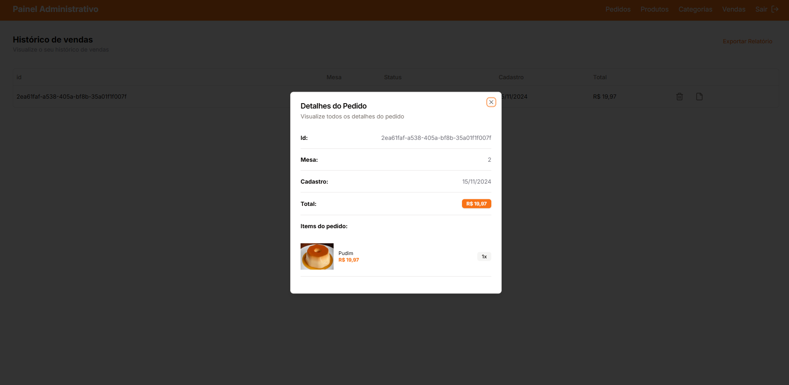
</p>

<h2 id="technologies">💻 Tecnologias</h2>

- React
- Next.js
- TypeScript
- TailwindCSS
- ShadcnUI

<h2 id="started">🚀 Primeiros passos</h2>

<h3>Pré-requisitos</h3>

- [Node.js](https://nodejs.org)
- [Git](https://git-scm.com/)

<h3>Clone o projeto</h3>

```bash
git clone https://github.com/reisArthur2602/sistema-pizzaria-frontend
```

<h3>Configure as váriaveis .env </h2>

Use o`.env.example` como referência para criar seu arquivo de configuração `.env` com suas credenciais.

```yaml
NEXT_PUBLIC_API_URL=
```

<h3>Rodar o Projeto</h3>

```bash
cd nome-do-projeto
npm install
npm run dev
```
